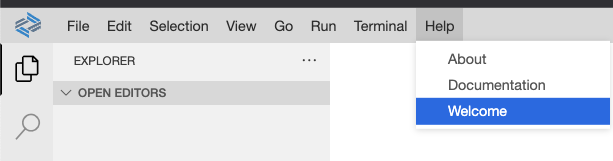
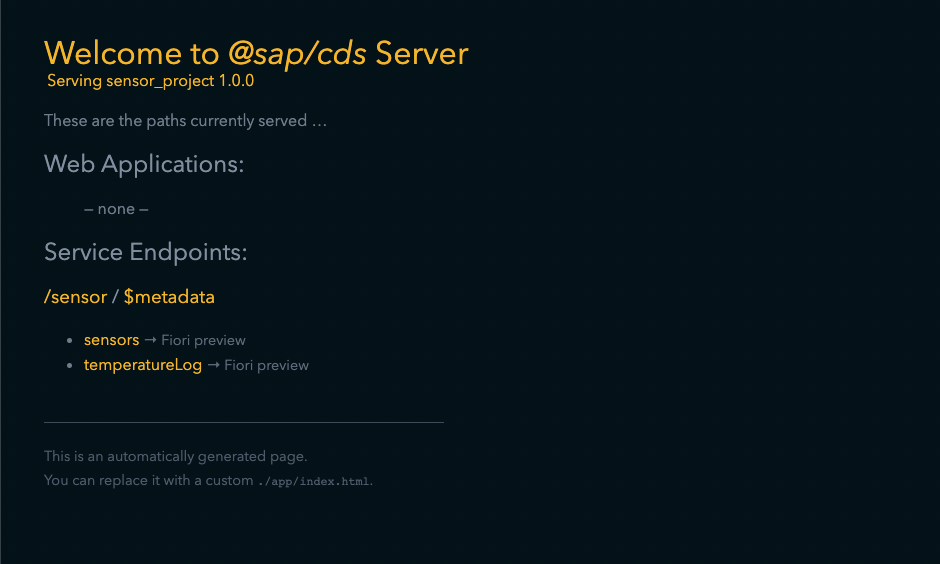
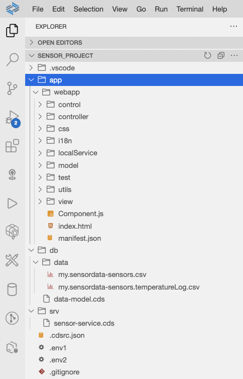

# Replace the local JSON data with an OData service

In exercise 3 of this workshop a *JSONModel* has been added to the sensormanager application which consists of a local json file in the project in the *localService* folder. The goal of this exercise is to replace the existing local json data by creating a new CAP project in Business Application Studio and to reuse the existing created *sensormanager* application from exercises 1-9.

## Exercise 1 - Create a new CAP project

First, select the *Help* button in the upper toolbar in BAS to select *Welcome*, this will open the welcome page again and provide the options to create a new application template.
<br><br><br><br>
Similar as in the beginning of creating the application template, select: *Start from template*, but this time select *CAP Project* as template.
<br><br><br><br>
Confirm the selection by pressing *Start* and enter the following values in the next screen of the application wizard:
<br><br><br><br>
1. Enter *sensor_project* as *project name*.
2. Choose *Node.js* as *runtime*.<br>

Confirm the configuation by pressing *Finish* and a new CAP project will be created:
<br><br><br><br>
Compared to our frontend project, there is a db and srv folder in addition to be used to create service definitions that we can make use of during this exercise. Let's begin by starting our project, by clicking the &#9654; icon in the left icon bar, you can now create new configurations to run your application with different parameters.
Press *Create Configuration* and a new popup will appear in the upper area in BAS:
<br><br><br><br>
Confirm the default, the next popup will allow you to specify a name for your configuration, enter *Run sensor project* as name for the run configuration and hit *Enter*.

## Exercise 2 - Create an OData SensorService

Before running the project, create a new data model by creating a new file in the *db* folder and name it *data-model.cds*, and copy the following content to the file:

````
namespace my.sensordata;

entity sensors {
    key index       : String;
        guid        : String;
        isActive    : Boolean;
        temperature : String;
        time        : String;
        distance    : String;

        @Aggregation.Groupable: true
        customer    : String;
        location    : String;
        status      : String;
        temperatureLog: Composition of many sensors.temperatureLog on temperatureLog.parent = $self;
}

entity sensors.temperatureLog {
    key ID          : UUID    @(Core.Computed : true);
    key parent      : Association to sensors;
        temperature : String;
        time        : String;
}

````

In this file the data model will be described, in this case its consisting of two entities:
- sensors -> contains the sensor specific information such as the current temperature, the location, distance and customer
- sensors.temperatureLog -> a composition used by the sensors to maintain simple log data with a time and temperature stamp

Taking a look at the prior used sensors json data, this data model will represent the same field definitions as priorly used by the JSONModel, but this time a service will be generated by consuming this data model. To do that, create a new file in the *srv* folder and name it *sensor-service.cds* - this will be used to define the sensor service to be used by the sensormanager application. Add the following code to this file: 

````
namespace my.sensordata;

using my.sensordata as my from '../db/data-model';

service SensorService {
    entity sensors as projection on my.sensors;
    entity temperatureLog as projection on my.sensors.temperatureLog;
}

````

This code is using the data model that has just been created, in addition two new entities are defined using the data model that are going to be reflected in the SensorService: *sensors* and *temperatureLog*.

Since the service and data model are ready, let's test it by executing the project using the run configuration *'Run sensor project'* created earlier, a mewssage that a ner service is listening to port 4004 should appear in the lower right corner, open it by pressing *Open in a New Tab*:
<br><br><br><br>
The following screen should appear:
<br><br><br><br>
You are now able to inspect the service endpoints that have just been created. Since a new project has been created, there are not yet any web applications available. Press on *sensors* to display the according endpoint, since there is not yet any data maintained, the values are empty.

To change that, add local csv data for the implemented service. Create a new folder in the *db* folder and name it *data*.
Create a new file *my.sensordata-sensors.csv* and paste the following sample csv data: [my.sensordata-sensors.csv](data/my.sensordata-sensors.csv)

Add another file in the *data* folder and name it *my.sensordata-sensors.temperatureLog.csv* and add the following content to it: [my.sensordata-sensors.temperatureLog.csv](data/my.sensordata-sensors.temperatureLog.csv)

Once this is setup, go to your run configurations and restart the project - once reselecting the servic endpoints created earlier, you should now be able to see the sample data that has been added to the service.

## Exercise 3 - Add a frontend to the project

Since the service is ready to be consumed, import the *Sensor Manager* application created earlier into the project. In the *File* menu in the upper left corner in BAS, you can reselect the sensor manager fiori project created earlier - once the fiori project has been selected, select *Download* in the *File* menu in BAS. Switch back in the *File* menu by opening the just created CAP project. In the *app* folder, rightclick and select *import*. The downloaded archive can be added to the project, the webapp folder should be placed in the *app* folder of the CAP project:
<br><br><br><br>
Restart the run configuration again. There is now an application available in the project:
<br><br><br><br>
Select */webapp/index.html* to execute the application. Since we have not yet changed the data source in the application configuration, there is still the json data being used. We need to change that by doing some adjustments in the data source definition of the *manifest.json*. Replace the *sensorSource* in the *dataSources* as following:

```json
"dataSources": {
    "sensorSource": {
        "uri": "/sensor/",
        "type": "OData",
        "settings": {
            "annotations": [],
            "odataVersion": "4.0"
        }
    }
}
```

This will replace the earlier created json data source pointing to the local json source to the *sensor* entity created in the *SensorService*. In addition an *OData* protocol type is specified instead of json, in the settings the version can be specified to use *4.0*.

In addition the according *sensormodel* created in ex3 consuming the *sensorSource* data, needs to be changed to use an OData 4.0 model instead of a JSONModel. To do that, replace the *sensorModel* as following:

```json
"sensorModel": {
    "dataSource": "sensorSource",
    "preload": true,
    "settings": {
    "synchronizationMode": "None",
    "operationMode": "Server",
    "autoExpandSelect": true,
    "earlyRequests": true
    }
}
```

You can now delete the json data added in exercise 3 by deleting the *sensors.json* file in the *localService* folder. Refresh your application, the application is now running on the service that has just been implemented. By opening the dev tools in the chrome browser by pressing *F12* you can switch to the *Network* tab. Notice that whenever a new filtering or selection has been triggered, a new *batch* request can be observed triggered by the odata model to the *SensorService*.

This service can now be enhanced with new fields, annotations to be consumed by complex applications and connected to a database - great! Your application is now running on an OData service.