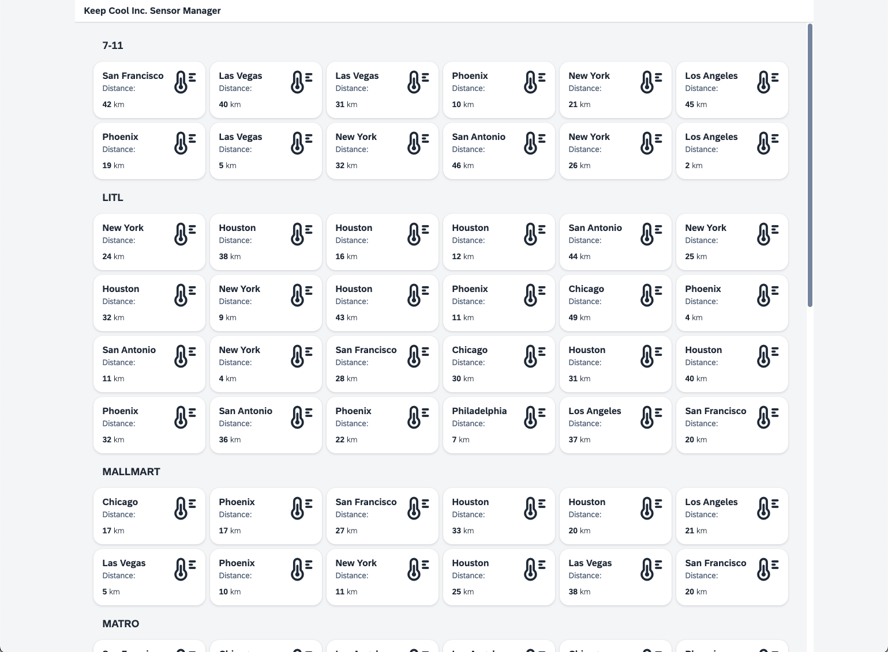
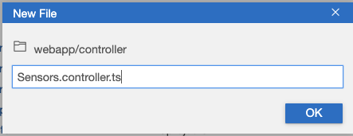
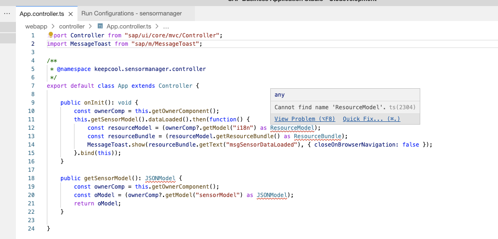

[](../../../../tree/code/ex5)
[](https://SAP-samples.github.io/teched2022-AD163/ex5/sensormanager/webapp/)

# Exercise 5 - Improve Visualization

You achieved a lot in the previous exercises. Now it's time to dress up your UI5 application with some visual effects!

## Exercise 5.1 - Enhance Sensors.view.xml

To give the customer the best possible overview, add some color to your application. Introduce a new layout and structure for the items, and also show an `sap.ui.core.Icon` there.

1. Open `Sensors.view.xml` and add the xml namespace `xmlns:core="sap.ui.core"` to the view to have the `sap.ui.core.Icon` available.

***sensormanager/webapp/view/Sensors.view.xml***

````xml
<mvc:View
    xmlns:core="sap.ui.core"
    xmlns:mvc="sap.ui.core.mvc"
    xmlns="sap.m"
    xmlns:grid="sap.ui.layout.cssgrid"
    xmlns:f="sap.f"
    displayBlock="true">
````

2. Add a temperature icon as well as layouting to the `sap.m.CustomListItem` control. `sapUiSmallMarginTop` and `sapUiSmallMarginEnd` are predefined responsive css classes, which add screen size dependent spacing to controls. `sap.m.HBox`and `sap.m.VBox` are helpers for layouting your application.

***sensormanager/webapp/view/Sensors.view.xml***

````xml
                            <CustomListItem  type="Active">
                                <layoutData>
                                    <FlexItemData
                                        growFactor="1"
                                        shrinkFactor="0"/>
                                </layoutData>
                                <HBox justifyContent="SpaceBetween">
                                    <VBox
                                        justifyContent="SpaceBetween"
                                        class="sapUiSmallMarginTop sapUiSmallMarginBegin">
                                        <Title text="{sensorModel>location}"/>
                                        <Label text="{i18n>distanceLabel}:"/>
                                    </VBox>
                                    <core:Icon
                                        src="sap-icon://temperature"
                                        size="2.5rem"
                                        class="sapUiSmallMarginTop sapUiSmallMarginEnd"/>
                                </HBox>
                                <HBox
                                    justifyContent="SpaceBetween"
                                    class="sapUiTinyMarginTop sapUiSmallMarginBottom sapUiSmallMarginBeginEnd">
                                    <ObjectNumber
                                        number="{sensorModel>distance}"
                                        unit="{i18n>distanceUnit}"/>
                                </HBox>
                            </CustomListItem>
````
Let's take a look at the application and the changes in the item layout of the `GridList` control:
<br><br><br><br>

## Exercise 5.2 - Create Sensors.controller.ts

In this exercise you'll enhance your application with some additional controller coding.

1. Right-click the `sensormanager/webapp/controller/` folder and select `New File`.
<br><br><br><br>

2. Enter `Sensors.controller.ts` as the file name.
<br><br><br><br>

3. All functions defined in the Controller can be used in your View. This gives you more flexibility to implement specific functionality to improve the visualization in your View. Add the following code to `Sensors.controller.ts`:

***sensormanager/webapp/controller/Sensors.controller.ts***

````js
import Controller from "sap/ui/core/mvc/Controller";
import MessageToast from "sap/m/MessageToast";

/**
 * @namespace keepcool.sensormanager.controller
 */
export default class Sensors extends Controller {

    public onInit(): void {

    }
}
````

4. Add the module `sap/m/MessageToast` mentioned above as dependency to the `Sensors.controller.ts`. You will use this dependency during this exercise.

5. Your next goal is to show an `sap.m.MessageToast` when your sensor data is loaded. Replace the `onInit` function of `Sensors.controller.ts` with the following content. This also adds a function `getSensorModel` to retrieve the sensor model.
Depending on the used code editor, you can also navigate to the definition of the respective UI5 API. E.g. in VSCode by holding the Ctrl key while clicking the name. This does not lead to the original source code of UI5, which is written in JavaScript, but to the TypeScript type definition files of UI5. Nevertheless it can be very helpful to browse through the methods offered by a class or to navigate further up the inheritance chain.<br>

***sensormanager/webapp/controller/Sensors.controller.ts***

```typescript
    public onInit(): void {
        const ownerComp = this.getOwnerComponent();
        if (this.getSensorModel().isA("sap.ui.model.json.JSONModel")) {
            this.getSensorModel().dataLoaded().then(function() {
                const resourceModel = (ownerComp?.getModel("i18n") as ResourceModel);
                const resourceBundle = (resourceModel.getResourceBundle() as ResourceBundle);
                MessageToast.show(resourceBundle.getText("msgSensorDataLoaded"), { closeOnBrowserNavigation: false });
            }.bind(this)).catch(function(oErr: Error){
                MessageToast.show(oErr.message, { closeOnBrowserNavigation: false });
            });
        }
    }

    public getSensorModel(): JSONModel {
        const ownerComp = this.getOwnerComponent();
        const oModel = (ownerComp?.getModel("sensorModel") as JSONModel);
        return oModel;
    }

```

Note that some of the modules are underlined in red. If you hover over the affected code, you can just implement the quickfix as suggested by BAS:
<br><br><br><br>
Just click on *Quick Fix* and select *Add all missing imports*. All required dependencies have now been added to the controller.

## Exercise 5.3 - Assign Controller to View

Now you need to tell your view which controller is associated with it.

1. Open `sensormanager/webapp/view/Sensors.view.xml`.

2. Add the `controllerName` attribute to the view and enter the controller name `keepcool.sensormanager.controller.Sensors`. The Controller's functions can then be used in your View. UI5 maps this path to the `sensormanager/webapp/controller/Sensors.controller.ts` file.

***sensormanager/webapp/view/Sensors.view.xml***

````xml
<mvc:View
    controllerName="keepcool.sensormanager.controller.Sensors"
    xmlns:core="sap.ui.core"
    xmlns:mvc="sap.ui.core.mvc"
    xmlns="sap.m"
    xmlns:grid="sap.ui.layout.cssgrid"
    xmlns:f="sap.f"
    displayBlock="true">
````

3. Let's see if your UI5 application is able to show the `sap.m.MessageToast`! Switch to the browser tab with the opened application preview and reload the page. The `sap.m.MessageToast` should be displayed to confirm that your sensor data has been loaded successfully.
<br><br><br><br>

## Exercise 5.4 - Create your First Formatter

Your next goal is to bring some color to the user interface. You'd like to display the icon in a suitable color which is based on the actual temperature of the sensor. To do this, you can use the formatter concept of UI5.

1. Open `sensormanager/webapp/controller/Sensors.controller.ts`.

2. Add the new function `formatIconColor` after the `getSensorModel` function.

***sensormanager/webapp/controller/Sensors.controller.ts***

````js
import Controller from "sap/ui/core/mvc/Controller";
import MessageToast from "sap/m/MessageToast";
import ResourceBundle from "sap/base/i18n/ResourceBundle";
import JSONModel from "sap/ui/model/json/JSONModel";
import ResourceModel from "sap/ui/model/resource/ResourceModel";
import { IconColor } from "sap/ui/core/library";

enum Threshold {
    Warm = 4,
    Hot = 5
}

/**
 * @namespace keepcool.sensormanager.controller
 */
export default class Sensors extends Controller {

    public onInit(): void {
        const ownerComp = this.getOwnerComponent();
        this.getSensorModel().dataLoaded().then(function() {
            const resourceModel = (ownerComp?.getModel("i18n") as ResourceModel);
            const resourceBundle = (resourceModel.getResourceBundle() as ResourceBundle);
            MessageToast.show(resourceBundle.getText("msgSensorDataLoaded"), { closeOnBrowserNavigation: false });
        }.bind(this)).catch(function(oErr: Error){
            MessageToast.show(oErr.message, { closeOnBrowserNavigation: false });
        });
    }

    public getSensorModel(): JSONModel {
        const ownerComp = this.getOwnerComponent();
        const model = (ownerComp?.getModel("sensorModel") as JSONModel);
        return model;
    }

    formatIconColor(temperature: number): IconColor|string {
        if (temperature < Threshold.Warm) {
            return "#0984e3";
        } else if (temperature >= Threshold.Warm && temperature < Threshold.Hot) {
            return IconColor.Critical;
        } else {
            return IconColor.Negative;
        }
    }
}
````

You can observe that TypeScript allows to specifiy the type of the *temperature* parameter. In addition TypeScript allows us to specify a type definition for the function. In this case the *IconColor* as return type.
Another advantage of TypeScript are enums. The theshold enum can be used to specifiy certain types of temperature status for the sensor in this example.

## Exercise 5.5 - Add the Formatter in your View

You're almost done. The last piece is adding the newly created formatter function to the binding of your icon.

1. Open `sensormanager/webapp/view/Sensors.view.xml`.

2. Add the `color` property to the `sap.ui.core.Icon` definition, bind the `color` property to the path `sensors>temperature/value`, and assign the formatter function to the binding.

***sensormanager/webapp/view/Sensors.view.xml***

````xml
                                    <core:Icon
                                        src="sap-icon://temperature"
                                        size="2.5rem"
                                        color="{path: 'sensorModel>temperature', formatter:'.formatIconColor'}"
                                        class="sapUiSmallMarginTop sapUiSmallMarginEnd"/>
````

3. Let's see if your UI5 application can now color icons depending on the sensor data! Switch to the browser tab with the opened application preview and reload the page. The sensor icons should be displayed either in black (default), yellow (critical) or red (negative).
<br><br><br><br>

## Summary

Congratulations, you completed the [Exercise 5 - Improve Visualization](#xxercise-5---improve-visualization) exercise!

Continue to [Exercise 6 - Filtering with the IconTabBar](../ex6/README.md).

## Further Information

* Model View Controller Concept: https://ui5.sap.com/#/topic/91f233476f4d1014b6dd926db0e91070
* Controller: https://ui5.sap.com/#/topic/121b8e6337d147af9819129e428f1f75
* Formatting, Parsing, and Validating Data: https://ui5.sap.com/#/topic/07e4b920f5734fd78fdaa236f26236d8
